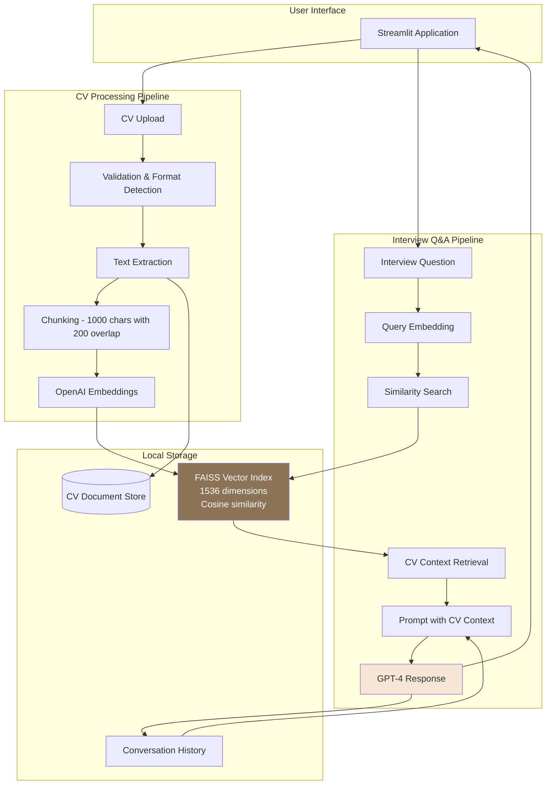
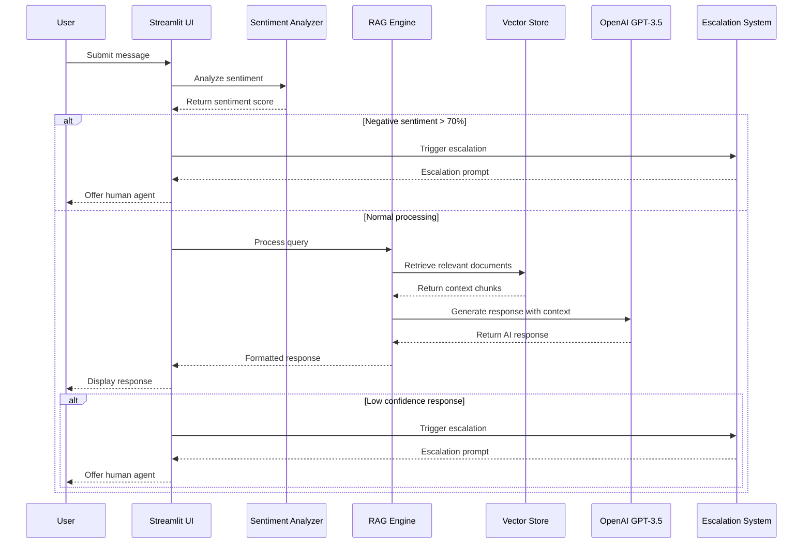
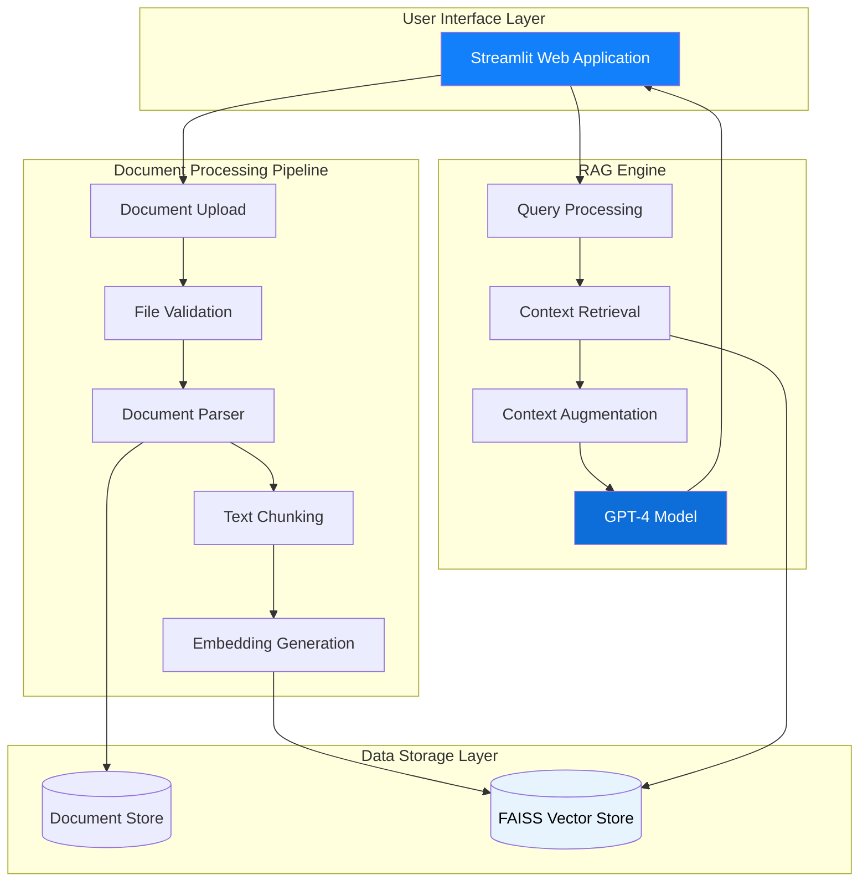
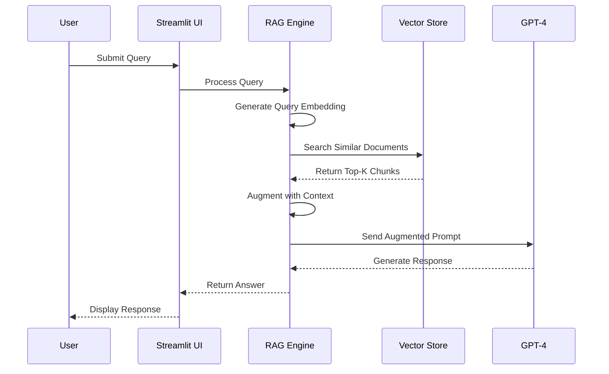
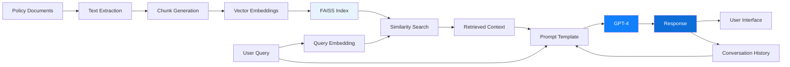
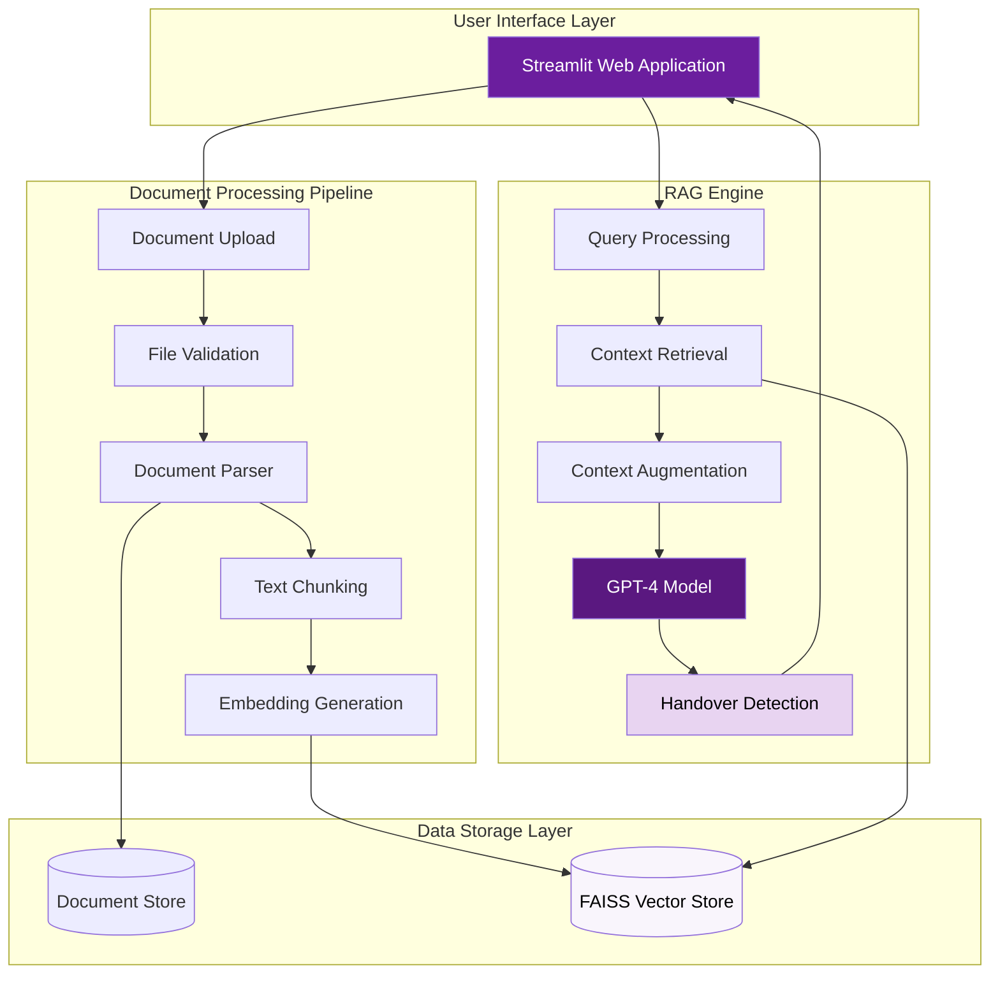
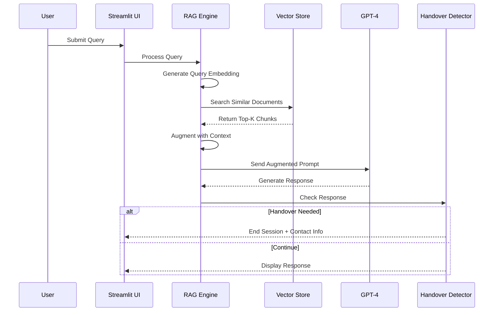
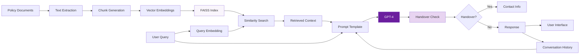

For Talent flowAI{# CV Interview Assistant: RAG-Powered Resume Chatbot

An AI-powered interview preparation tool that transforms your CV into an intelligent conversational agent. Built with FAISS for vector storage, OpenAI embeddings, and GPT-4. Developed for Silvertree Brands using Streamlit and LangChain.


---

## Table of Contents
- Overview
- Business Context
- Technology Stack
- System Architecture
- Installation
- Configuration
- Knowledge Base
- Usage
- Deployment
- Project Structure
- Technical Documentation
- Troubleshooting
- Contributing
- Acknowledgments

---

## Overview

This project is an AI-powered interview preparation tool that reads your CV and answers questions about it - like having a conversation with your resume. Instead of fumbling through your CV during interview prep, upload your resume and ask natural questions like "What's my most relevant project experience?" or "How many years of Python experience do I have?" to get instant, accurate answers.
 
**GitHub Repository**: [Kayanja2023/Rag](https://github.com/Kayanja2023/Rag)  
**Technical Documentation**: [Confluence Documentation](https://andilemlwanga.atlassian.net/wiki/x/DID1)

---

## Business Context

**Client**: Silvertree Brands  
**Project Type**: Interview Preparation Tool  
**Development Time**: <4 hours (Proof of Concept)

This RAG system enables candidates to quickly access and query their CV through natural language during interview preparation. The same pattern applies to various document-based Q&A scenarios:

- **HR Teams**: Query employee handbooks or policy documents
- **Legal Teams**: Search contracts and case files
- **Sales Teams**: Query product documentation during client calls
- **Customer Support**: Access knowledge bases for faster ticket resolution

The key insight: Instead of searching documents manually or relying on AI to "remember" everything (which leads to hallucinations), this combines precise document retrieval with natural language understanding.

---

## Technology Stack

| Component   | Technology                        | Reasoning                                                      |
|------------|-----------------------------------|----------------------------------------------------------------|
| Use Case    | CV Interview Assistant           | Interview preparation, resume Q&A                              |
| Vector DB   | FAISS                            | Fast similarity search, local deployment, production-ready     |
| Embeddings  | OpenAI text-embedding-3-small    | High-quality semantic understanding, 1536 dimensions           |
| LLM         | GPT-4                            | Advanced reasoning, reliable API, accurate responses           |
| Framework   | LangChain                        | Modular RAG orchestration, memory management                   |
| Frontend    | Streamlit                        | Rapid prototyping (<4 hours), interactive UI, easy deployment  |

---

## System Architecture

### RAG Pipeline Flow



### Technical Flow

**Document Processing (One-time)**:
1. CV Upload (PDF, DOCX, TXT, MD)
2. Text Extraction → Raw CV content
3. Chunking → 1000-character segments with 200-char overlap
4. Embedding → Convert to 1536-dimensional vectors
5. FAISS Indexing → Fast similarity search

**Query Pipeline (Per Question)**:
1. User asks interview question
2. Question embedded to vector
3. FAISS searches for 3 most similar CV chunks
4. Chunks + question + conversation history → GPT-4
5. GPT-4 generates answer based on CV content
6. Response displayed with source context

---

## Installation

### Prerequisites
- Python 3.8+
- OpenAI API key
- Streamlit
- LangChain
- FAISS
- OpenAI Python SDK

### Steps
1. Clone the repository
2. Create and activate a virtual environment (`python -m venv .venv`)
3. Install dependencies (`pip install -r requirements.txt`)
4. Configure OpenAI API key in `.env`
5. Run `streamlit run app.py`

---

## Configuration

Edit `config.py` for:
- FAISS index storage path
- Embedding model: `text-embedding-3-small`
- LLM: GPT-4
- Chunk size (1000), overlap (200)
- Allowed file types (TXT, PDF, DOCX, MD)
- Maximum file size (50MB)

Key settings:
```python
CHUNK_SIZE = 1000           # Characters per chunk
CHUNK_OVERLAP = 200         # Overlap between chunks
MODEL = "gpt-4"             # OpenAI model
TEMPERATURE = 0.7           # Response creativity
SEARCH_K = 3                # Number of chunks to retrieve
MAX_FILE_SIZE = 50 * 1024 * 1024  # 50MB limit
ALLOWED_EXTENSIONS = ["txt", "pdf", "docx", "md"]
```

---

## Knowledge Base

The system supports uploading your CV in various formats:

| Format | Loader | Purpose |
|--------|--------|---------|
| PDF    | PyPDFLoader | Standard CV format |
| DOCX   | Docx2txtLoader | Microsoft Word resumes |
| TXT    | TextLoader | Plain text CVs |
| MD     | TextLoader | Markdown formatted resumes |

### How It Works

1. **Upload Your CV**: Use the sidebar to upload your resume (one file recommended)
2. **Automatic Processing**: System extracts text, chunks into segments, and creates searchable index
3. **Ask Questions**: Query your CV like talking to a recruiter

### Typical Interview Questions You Can Ask

**Technical Skills**:
- "What programming languages do I know?"
- "What are my technical skills?"
- "Do I have experience with [specific technology]?"

**Work Experience**:
- "Tell me about my work experience"
- "What was my role at [company name]?"
- "How many years of experience do I have in [field]?"

**Projects**:
- "What are my most relevant projects?"
- "Describe my [project name] project"
- "What technologies did I use in my projects?"

**Education**:
- "What is my educational background?"
- "Where did I study?"
- "What degrees do I have?"

**Achievements**:
- "What are my key achievements?"
- "What awards or recognition have I received?"

---

## Usage

### Quick Start Guide

1. **Launch Application**
```powershell
streamlit run app.py
```

2. **Upload Your CV**
   - Click "Knowledge Base Management" in sidebar
   - Upload your CV (PDF, DOCX, TXT, or MD)
   - Wait for processing confirmation

3. **Start Interview Prep**
   - Type questions in the chat interface
   - Get instant answers based on your CV
   - Follow up with clarifying questions
   - Conversation memory maintains context

### Example Conversation

```
You: What are my technical skills?
Assistant: Based on your CV, your technical skills include Python, JavaScript, 
React, Node.js, SQL, MongoDB, Docker, and AWS. You also have experience with 
Git and Agile methodologies.

You: How many years of Python experience do I have?
Assistant: According to your CV, you have 5 years of Python experience, 
starting from your role as Junior Developer at TechCorp in 2020 through 
your current position.

You: What's my most impressive project?
Assistant: Your most impressive project appears to be the E-commerce Platform 
you built at Current Company, which handled 10,000+ daily transactions and 
reduced page load times by 40% using React and Node.js microservices.
```

### Managing Your Session

- **Clear Chat**: Reset conversation to start fresh preparation
- **Upload New CV**: Replace with updated resume (rebuilds index automatically)
- **Multiple Questions**: Ask follow-ups - system remembers previous context

---

## Deployment

### Streamlit Community Cloud
1. Push code to GitHub
2. Connect repository at share.streamlit.io
3. Configure secrets (OPENAI_API_KEY)
4. Deploy application

### Production Considerations
- Secure API keys in environment variables
- Monitor OpenAI API usage and costs
- Implement rate limiting for queries
- Regular vector store backups
- User authentication for internal systems

---

## Project Structure

```
Rag/
│
├── app.py                        # Main Streamlit application
├── rag_engine.py                 # RAG pipeline with FAISS
├── config.py                     # Configuration management
├── utils.py                      # File processing utilities
├── requirements.txt              # Python dependencies
├── .env                          # Environment variables (not in repo)
├── .gitignore                    # Git ignore rules
└── README.md                     # This file
│
├── data/
│   ├── documents/               # CV storage (created on first upload)
│   └── faiss_store/             # FAISS vector index (auto-generated)
│       ├── index.faiss          # Vector index file
│       └── index.pkl            # Metadata pickle
│
└── assets/                       # Static assets
```

---

## Technical Documentation

| Component   | Technology                        | Details                                    |
|------------|-----------------------------------|--------------------------------------------|
| Frontend    | Streamlit                        | Interactive web UI                         |
| Framework   | LangChain                        | RAG orchestration                          |
| Vector DB   | FAISS                            | Local, cosine similarity, 1536 dimensions  |
| Embeddings  | OpenAI text-embedding-3-small    | 1536-dim vectors, semantic understanding   |
| LLM         | GPT-4                            | OpenAI, advanced reasoning                 |
| Language    | Python 3.8+                      | Core programming language                  |

### RAG Pipeline Details
- **Document Processing**: Multi-format support with atomic file operations
- **Text Chunking**: 1000 characters with 200-character overlap
- **Embedding Generation**: OpenAI text-embedding-3-small (1536 dimensions)
- **Vector Search**: FAISS with cosine similarity
- **Context Retrieval**: Top-3 most relevant chunks
- **Response Generation**: GPT-4 with conversation memory

---

## Acknowledgments

**Developed for**: Silvertree Brands - Interview Preparation Tool Challenge  
**Development Time**: <4 hours (Rapid Prototype)  
**Technical Documentation**: [Confluence Wiki](https://andilemlwanga.atlassian.net/wiki/x/DID1)

**Technology Partners**:
- OpenAI for GPT-4 and embeddings
- Facebook AI Research for FAISS
- LangChain for RAG framework
- Streamlit for rapid UI development

**Key Learning**: Combining retrieval precision with LLM reasoning eliminates hallucinations while maintaining natural conversation flow - perfect for interview preparation where accuracy matters.

- No rate limiting (vulnerable to abuse)
- OpenAI API key exposed to server (not user-isolated)


## 📚 Technical Stack

### Core Dependencies

| Package | Version | Purpose |
|---------|---------|---------|
| `streamlit` | 1.22+ | Web UI framework |
| `langchain` | 1.0+ | RAG orchestration |
| `langchain-openai` | 1.0+ | OpenAI integrations |
| `faiss-cpu` | 1.7+ | Vector similarity search |
| `pdfplumber` | 0.7+ | PDF text extraction |
| `python-docx` | 0.8+ | DOCX parsing |
| `python-dotenv` | 1.0+ | Environment management |

### Architecture Patterns

- **Caching Strategy**: `@st.cache_resource` for embeddings & vector store
- **State Management**: Streamlit session state for UI persistence
- **Error Handling**: Try-except with user-friendly messages
- **File I/O**: Atomic operations with temp files
- **Memory Management**: LRU-style tracking with size limits


}CX-sentinel {# RAG Augmented Chatbot with Sentiment analysis and Human in the loop escalation

## Architecture

### System Components

- **RAG Engine**: FAISS vector database with OpenAI GPT-3.5-turbo
- **Sentiment Analysis**: RoBERTa-based classification model
- **Document Processing**: Multi-format ingestion (TXT, MD, PDF, DOCX)
- **Session Management**: Persistent conversation state
- **Escalation System**: Automated human handoff triggers

### Sequence Diagram



## Installation

### Prerequisites

- Python 3.8 or higher
- OpenAI API key
- Git

### Setup

1. Clone repository:
```bash
git clone <repository-url>
cd grad_project
```

2. Install dependencies:
```bash
pip install -r requirements.txt
```

3. Configure environment variables in `.env`:
```env
OPENAI_API_KEY=your_api_key_here
```

4. Create knowledge base directory:
```bash
mkdir -p data/documents
```

5. Launch application:
```bash
streamlit run clickatell_chatbot_single.py
```

## Configuration

### Environment Variables

| Variable | Description | Required |
|----------|-------------|----------|
| `OPENAI_API_KEY` | OpenAI API authentication key | Yes |

### Model Configuration

The system uses the following models (configurable in [clickatell_chatbot_single.py](clickatell_chatbot_single.py)):

```python
EMBEDDING_MODEL = "sentence-transformers/all-MiniLM-L6-v2"
CHAT_MODEL = "gpt-3.5-turbo"
CHUNK_SIZE = 600
CHUNK_OVERLAP = 80
SEARCH_RESULTS = 5
```

### Sentiment Analysis Configuration

Sentiment thresholds in [analyze_sentiment()](clickatell_chatbot_single.py#L234):

```python
if sentiment["label"] == "negative" and sentiment["score"] > 0.7:
    escalation_reason = "negative_sentiment"
```

## Project Structure

```
grad_project/
├── clickatell_chatbot_single.py    # Main application
├── README.md                       # Documentation
├── requirements.txt               # Dependencies
├── .env                          # Environment configuration
├── data/
│   └── documents/               # Knowledge base files
├── vector_store/               # FAISS index storage
└── components/
    └── ui/
        └── assets/
            └── logo.png        # Application logo
```

## Core Functions

### Document Processing

The [load_documents_from_folder()](clickatell_chatbot_single.py#L156) function handles multi-format document ingestion:

```python
def load_documents_from_folder():
    """Load all supported documents from data/documents folder."""
    # Supports .txt, .md, .pdf, .docx formats
    # Returns list of Document objects with metadata
```

### Vector Store Management

The [create_vector_store()](clickatell_chatbot_single.py#L124) function manages FAISS index creation and loading:

```python
def create_vector_store():
    """Create or load FAISS vector store from documents folder."""
    # Handles index persistence and document chunking
    # Returns configured FAISS store
```

### Conversation Chain

The [create_chat_chain()](clickatell_chatbot_single.py#L186) function builds the RAG pipeline:

```python
def create_chat_chain(vector_store):
    """Create the conversational RAG chain"""
    # Combines retriever, prompt template, and LLM
    # Returns RunnableWithMessageHistory instance
```

### Sentiment Analysis

The [analyze_sentiment()](clickatell_chatbot_single.py#L234) function processes user input:

```python
def analyze_sentiment(text, session_id=None):
    """Analyze sentiment using RoBERTa model."""
    # Returns {"label": str, "score": float}
    # Handles preprocessing for social media text
```

### Escalation Logic

The [trigger_escalation()](clickatell_chatbot_single.py#L278) function manages human handoff:

```python
def trigger_escalation(reason, session_id):
    """Generate appropriate escalation message based on trigger reason."""
    # Handles different escalation scenarios
    # Returns formatted escalation prompt
```

## Dependencies

```txt
streamlit>=1.28.0
langchain>=0.1.0
langchain-community>=0.0.20
langchain-openai>=0.0.5
langchain-huggingface>=0.0.1
faiss-cpu>=1.7.4
transformers>=4.35.0
torch>=2.0.0
python-dotenv>=1.0.0
PyPDF2>=3.0.1
docx2txt>=0.8
```

## Usage

### Basic Operation

1. Start the application using `streamlit run clickatell_chatbot_single.py`
2. Access the interface at `http://localhost:8501`
3. Add knowledge base documents to `data/documents/`
4. Interact through the chat interface

### Knowledge Base Management

Supported document formats:
- Text files (.txt, .md)
- PDF documents (.pdf)
- Word documents (.docx)

Documents are automatically processed and indexed on application startup.

### Escalation Triggers

The system triggers escalation under these conditions:
- Negative sentiment with confidence > 70%
- AI response contains knowledge limitation indicators
- Processing errors occur

## Troubleshooting

### Common Issues

**API Key Error**
```
ValueError: OPENAI_API_KEY not found in environment variables
```
Solution: Verify `.env` file exists with valid API key

**Document Loading Error**
```
No documents found in data/documents folder
```
Solution: Create directory and add supported file formats

**Vector Store Error**
```
Failed to load vector store
```
Solution: Delete `vector_store/` directory to force rebuild

### Performance Optimization

- Limit document size for faster processing
- Adjust `CHUNK_SIZE` based on content complexity
- Monitor OpenAI API rate limits and usage

## Development

### Code Structure

The application follows a modular architecture:

- **Configuration**: Constants and environment setup
- **AI Components**: RAG pipeline and sentiment analysis
- **UI Components**: Streamlit interface elements
- **Main Application**: Orchestration and message processing

### Key Classes and Functions

- [initialize_embeddings()](clickatell_chatbot_single.py#L89): HuggingFace embedding model setup
- [initialize_sentiment_analyzer()](clickatell_chatbot_single.py#L104): RoBERTa sentiment model initialization
- [process_message()](clickatell_chatbot_single.py#L456): Main message processing pipeline
- [main()](clickatell_chatbot_single.py#L548): Application entry point

## User-Interface
#### *Image 1: Neutral sentiment*  

 &nbsp;&nbsp;&nbsp;

#### *Image 2: Positive sentiment*  

 &nbsp;
#### *Image 3: Negative sentiment*  


}RetailDash Hub {# PEP Merchandising Intelligence Hub

A Retrieval-Augmented Generation (RAG) system designed to provide instant access to PEP's merchandising policies, buying procedures, supplier information, and performance metrics. Built with Streamlit, LangChain, and OpenAI GPT-4.

[](https://www.python.org/downloads/)
[](https://streamlit.io/)
[](https://www.langchain.com/)
[](#license)

---

## Table of Contents

- [Overview](#overview)
- [Features](#features)
- [System Architecture](#system-architecture)
- [Installation](#installation)
- [Configuration](#configuration)
- [Knowledge Base](#knowledge-base)
- [Usage](#usage)
- [Testing](#testing)
- [Deployment](#deployment)
- [Project Structure](#project-structure)
- [Technical Documentation](#technical-documentation)
- [Troubleshooting](#troubleshooting)
- [Contributing](#contributing)
- [License](#license)

---

## Overview

The PEP Merchandising Intelligence Hub is an internal business intelligence tool designed for PEP South Africa's Buying, Planning, and Merchandising teams. As South Africa's largest single brand retailer, PEP requires efficient access to critical operational knowledge including buying procedures, supplier directories, pricing strategies, and compliance standards.

This system uses advanced natural language processing to enable teams to query complex business documentation through conversational interfaces, eliminating time spent searching through policy documents and manuals.

### Target Users

- Buying Teams
- Planning & Merchandising Professionals
- Category Managers
- Supplier Relationship Managers
- Compliance Officers

### Key Capabilities

- Natural language queries about merchandising policies
- Instant retrieval of supplier contact information
- Quick access to approval workflows and thresholds
- Performance benchmark and KPI references
- Pricing margin calculations and guidelines

---

## Features

### Core Functionality

**Intelligent Document Search**
- Vector-based semantic search across all merchandising documentation
- FAISS (Facebook AI Similarity Search) for high-performance retrieval
- Context-aware responses using GPT-4
- Maintains conversation history for follow-up questions

**Knowledge Management**
- Multi-format document support (TXT, PDF, DOCX, Markdown)
- Automatic document validation and processing
- Vector store persistence for fast query response
- Atomic file operations to prevent data corruption

**Business Intelligence**
- Buying procedures and approval hierarchies
- Vendor directory with contact information and terms
- Pricing strategies and margin calculations
- Performance metrics and benchmarks
- Compliance standards and quality requirements
- Merchandising guidelines and best practices

### User Experience

**Professional Interface**
- PEP corporate branding (Azure Radiance #1180FA)
- Clean, business-focused design
- Responsive layout for desktop and tablet use
- Document management sidebar
- Session persistence

**Session Management**
- Conversation history maintained throughout session
- Clear chat functionality for new queries
- Message display with user/assistant differentiation

---

## System Architecture

### High-Level Architecture



### RAG Pipeline Flow



### Data Flow



---

## Installation

### Prerequisites

- Python 3.11 or higher
- OpenAI API key with GPT-4 access
- Git
- Windows, macOS, or Linux operating system

### Step-by-Step Installation

**1. Clone the Repository**

```bash
git clone https://github.com/Kayanja2023/RAG-PEP-AI-MERCHENDISING-HUB.git
cd RAG-PEP-AI-MERCHENDISING-HUB
```

**2. Create Virtual Environment**

```bash
# Windows
python -m venv .venv
.venv\Scripts\activate

# macOS/Linux
python3 -m venv .venv
source .venv/bin/activate
```

**3. Install Dependencies**

```bash
pip install --upgrade pip
pip install -r requirements.txt
```

**4. Configure Environment Variables**

Create a `.env` file in the root directory:

```env
OPENAI_API_KEY=your_openai_api_key_here
```

**5. Verify Installation**

```bash
# Run tests to verify setup
python -m unittest discover -s tests -p "test_*.py"
```

**6. Launch Application**

```bash
streamlit run app.py
```

The application will open in your default browser at `http://localhost:8501`

---

## Configuration

### Application Settings

Edit `config.py` to customize system behavior:

```python
# Document Processing Configuration
CHUNK_SIZE = 1000           # Characters per text chunk
CHUNK_OVERLAP = 200         # Overlap between consecutive chunks
MAX_FILE_SIZE = 52428800    # Maximum upload size (50MB)

# AI Model Configuration
MODEL = "gpt-4"             # OpenAI model identifier
TEMPERATURE = 0.7           # Response creativity (0.0 - 1.0)
SEARCH_K = 3                # Number of context chunks to retrieve

# File Support
ALLOWED_EXTENSIONS = ["txt", "pdf", "docx", "md"]
```

### Directory Structure

```python
DOCS_DIR = "data/documents"      # Knowledge base storage
FAISS_DIR = "data/faiss_store"   # Vector embeddings storage
```

### Environment Variables

| Variable | Required | Description |
|----------|----------|-------------|
| `OPENAI_API_KEY` | Yes | OpenAI API authentication key |
| `MODEL` | No | Override default GPT model |
| `TEMPERATURE` | No | Override default temperature |

---

## Knowledge Base

### Pre-Loaded Documentation

The system includes comprehensive PEP merchandising documentation:

| Document | Content | Purpose |
|----------|---------|---------|
| `pep-buying-procedures.md` | Purchase order workflows, approval hierarchies, authorization thresholds | Operational guidance for buying teams |
| `pep-compliance-standards.md` | Quality requirements, regulatory compliance, audit procedures | Compliance and quality assurance |
| `pep-merchandising-guidelines.md` | Category management, product planning, range architecture | Strategic merchandising direction |
| `pep-performance-benchmarks.md` | KPIs, targets, performance metrics, success criteria | Performance measurement and tracking |
| `pep-pricing-margins.md` | Pricing formulas, margin targets, markdown policies | Financial and pricing strategy |
| `pep-vendor-directory.md` | Supplier contacts, lead times, payment terms, quality ratings | Supplier relationship management |

**Total Knowledge Base**: Approximately 15,000+ words covering PEP's merchandising operations.

### Adding Documents

**Via User Interface:**
1. Navigate to sidebar "Knowledge Base Management"
2. Click "Upload Documents"
3. Select supported file formats
4. System automatically processes and indexes

**Via File System:**
1. Place files in `data/documents/` directory
2. Restart application to rebuild vector store

### Document Requirements

- **Supported Formats**: TXT, PDF, DOCX, MD
- **Maximum Size**: 50MB per file
- **Character Encoding**: UTF-8 recommended
- **Naming Convention**: Descriptive, lowercase with hyphens

---

## Usage

### Starting a Session

1. Launch application: `streamlit run app.py`
2. Verify documents are loaded (sidebar shows count)
3. Begin querying in the chat interface

### Example Queries

**Buying Procedures**
- "What is the approval threshold for purchase orders over R500,000?"
- "Explain the three-tier approval hierarchy"
- "How do I submit a purchase order for approval?"

**Supplier Information**
- "Who is the primary contact for denim suppliers?"
- "What are the payment terms for Supplier XYZ?"
- "Show me suppliers with lead times under 30 days"

**Pricing & Margins**
- "What is the target margin for footwear?"
- "How do I calculate markdown pricing?"
- "What are the margin benchmarks for different product categories?"

**Performance Metrics**
- "What KPIs are tracked for buying performance?"
- "Show me the sell-through rate targets"
- "What are the stock turn expectations?"

**Compliance**
- "What quality standards must suppliers meet?"
- "Explain the compliance audit process"
- "What documentation is required for new vendor onboarding?"

### Managing Conversations

**Clear Chat**: Reset conversation history for new topic
**Document Upload**: Add new policies to knowledge base
**Delete Documents**: Remove outdated files from system

---

## Testing

### Test Suite Overview

The project includes comprehensive unit tests covering all core functionality:

| Test File | Coverage | Test Count |
|-----------|----------|------------|
| `test_config.py` | Configuration & file operations | 22 tests |
| `test_utils.py` | Text extraction utilities | 10 tests |
| `test_rag_engine.py` | RAG pipeline & document processing | 18 tests |
| `test_app_functions.py` | UI logic & session management | 19 tests |

### Running Tests

**All Tests**
```bash
python -m unittest discover -s tests -p "test_*.py" -v
```

**Specific Test File**
```bash
python -m unittest tests.test_rag_engine -v
```

**With Coverage Report**
```bash
python -m coverage run --source=. -m unittest discover -s tests
python -m coverage report
python -m coverage html
```

**Using Pytest**
```bash
pip install pytest pytest-cov
pytest tests/ -v
pytest tests/ --cov=. --cov-report=html
```

### Test Coverage

Current coverage: **77%** (669/869 statements)

Areas covered:
- Configuration validation
- File I/O operations
- Document parsing (TXT, PDF, DOCX, MD)
- Vector embedding generation
- FAISS index operations
- Chat chain construction
- Session state management
- Error handling and edge cases

---

## Deployment

### Streamlit Community Cloud

**Prerequisites**
- GitHub repository with code
- Streamlit Community Cloud account
- OpenAI API key

**Deployment Steps**

1. **Prepare Repository**
```bash
git add .
git commit -m "Prepare for deployment"
git push origin main
```

2. **Deploy Application**
- Navigate to https://share.streamlit.io
- Click "New app"
- Select repository: `Kayanja2023/RAG-PEP-AI-MERCHENDISING-HUB`
- Branch: `main`
- Main file: `app.py`
- Click "Deploy"

3. **Configure Secrets**
- Open app settings in Streamlit dashboard
- Navigate to "Secrets"
- Add:
```toml
OPENAI_API_KEY = "sk-..."
```

4. **Verify Deployment**
- Access provided URL
- Test document loading
- Validate query responses

### Production Considerations

**Security**
- Implement authentication (Streamlit supports SSO)
- Restrict access to internal network
- Use environment-specific API keys
- Enable HTTPS for data in transit

**Performance**
- Monitor OpenAI API usage and costs
- Implement rate limiting for queries
- Cache frequently accessed responses
- Regular vector store optimization

**Maintenance**
- Schedule regular document updates
- Monitor application logs
- Track query patterns for improvement
- Backup vector store periodically

---

## Project Structure

```
RAG-PEP-AI-MERCHENDISING-HUB/
├── app.py                      # Main Streamlit application
├── rag_engine.py              # RAG pipeline implementation
├── config.py                  # Configuration management
├── utils.py                   # Text extraction utilities
├── requirements.txt           # Python dependencies
├── .env                       # Environment variables (not in repo)
├── .gitignore                # Git exclusions
├── README.md                 # This file
├── DOCUMENTATION.md          # Technical deep-dive
│
├── data/
│   ├── documents/            # Knowledge base files
│   │   ├── pep-buying-procedures.md
│   │   ├── pep-compliance-standards.md
│   │   ├── pep-merchandising-guidelines.md
│   │   ├── pep-performance-benchmarks.md
│   │   ├── pep-pricing-margins.md
│   │   └── pep-vendor-directory.md
│   │
│   ├── documents_backup/     # Document version history
│   │
│   └── faiss_store/          # Vector embeddings
│       ├── index.faiss       # FAISS index file
│       └── index.pkl         # Metadata pickle
│
├── tests/
│   ├── __init__.py
│   ├── test_config.py        # Configuration tests
│   ├── test_utils.py         # Utility function tests
│   ├── test_rag_engine.py    # RAG pipeline tests
│   ├── test_app_functions.py # UI logic tests
│   └── README.md             # Testing documentation
│
└── assets/                   # Static resources (if needed)
```

---

## Technical Documentation

### Core Technologies

| Component | Technology | Version | Purpose |
|-----------|-----------|---------|---------|
| Frontend | Streamlit | 1.22+ | Web application framework |
| LLM | OpenAI GPT-4 | Latest | Natural language generation |
| Embeddings | OpenAI text-embedding-3-small | Latest | Text vectorization |
| Vector Store | FAISS | 1.7.4+ | Similarity search engine |
| Framework | LangChain | 0.3.9 | RAG pipeline orchestration |
| Language | Python | 3.11+ | Core programming language |

### RAG Implementation Details

**Document Processing**
1. Upload validation (size, format, duplicates)
2. Text extraction using format-specific loaders
3. Recursive character-based text splitting
4. Chunk size: 1000 characters with 200-character overlap
5. Embedding generation via OpenAI API
6. FAISS index creation and persistence

**Query Processing**
1. User input received via Streamlit chat
2. Query embedding generation
3. FAISS similarity search (top-k=3)
4. Context retrieval from matched chunks
5. Prompt template augmentation with context
6. GPT-4 response generation
7. Response display with conversation history

**Memory Management**
- Session state stores conversation history
- ChatMessageHistory maintains message sequencing
- RunnableWithMessageHistory enables context continuity
- Clear chat resets session state

### Performance Characteristics

- **Embedding Generation**: ~100ms per document chunk
- **Vector Search**: <10ms for top-k retrieval
- **LLM Response**: 1-3 seconds depending on complexity
- **Document Upload**: 2-5 seconds processing per file
- **Concurrent Users**: Supports multiple sessions via Streamlit

---

## Troubleshooting

### Common Issues

**Issue: ModuleNotFoundError**
```bash
# Solution: Reinstall dependencies
pip install -r requirements.txt
```

**Issue: OpenAI Authentication Error**
```bash
# Solution: Verify API key in .env file
OPENAI_API_KEY=sk-your-actual-key-here
```

**Issue: FAISS Import Error**
```bash
# Solution: Install CPU version of FAISS
pip uninstall faiss-gpu
pip install faiss-cpu
```

**Issue: Documents Not Loading**
- Verify files exist in `data/documents/`
- Check file extensions are supported
- Ensure file sizes are under 50MB
- Review file encoding (use UTF-8)

**Issue: Vector Store Not Updating**
```bash
# Solution: Clear and rebuild
# Delete data/faiss_store/ directory
# Restart application
streamlit run app.py
```

**Issue: Slow Query Response**
- Check OpenAI API status
- Verify internet connectivity
- Consider reducing SEARCH_K value
- Monitor API rate limits

**Issue: Memory Errors**
- Reduce CHUNK_SIZE in config.py
- Clear vector store and rebuild
- Process large documents in batches

### Logging and Debugging

Enable detailed logging:
```python
import logging
logging.basicConfig(level=logging.DEBUG)
```

Check Streamlit logs:
```bash
streamlit run app.py --logger.level=debug
```

---

## Contributing

### Development Workflow

**1. Create Feature Branch**
```bash
git checkout -b feature/your-feature-name
```

**2. Implement Changes**
- Follow PEP 8 style guidelines
- Add docstrings to all functions
- Include type hints where appropriate
- Write unit tests for new functionality

**3. Run Tests**
```bash
python -m unittest discover -s tests -v
```

**4. Commit Changes**
```bash
git add .
git commit -m "Feature: Description of changes"
```

**5. Push and Create Pull Request**
```bash
git push origin feature/your-feature-name
```

### Code Standards

**Python Style**
- Follow PEP 8 conventions
- Maximum line length: 100 characters
- Use meaningful variable names
- Add comments for complex logic

**Documentation**
- Docstrings for all functions and classes
- Update README for user-facing changes
- Maintain DOCUMENTATION.md for technical details

**Testing**
- Minimum 75% code coverage
- Test both success and failure cases
- Mock external API calls
- Use descriptive test names

---

## License

This project is proprietary software developed for internal use by PEP South Africa. All rights reserved.

**Internal Use Only**: This system is designed exclusively for PEP employees and authorized personnel. Unauthorized access, distribution, or modification is prohibited.

**Third-Party Components**: This software uses open-source libraries (see requirements.txt) which are subject to their respective licenses.

---

## Support and Contact

### Technical Support

**Internal IT Support**
- Email: it-support@pep.co.za
- Extension: 1234

**Application Issues**
- Create issue in GitHub repository
- Contact: development-team@pep.co.za

### Business Inquiries

**Merchandising Department**
- Email: merchandising@pep.co.za
- Phone: +27 (0)21 123 4567

---

## Acknowledgments

Developed for PEP South Africa's Buying, Planning & Merchandising teams to enhance operational efficiency and knowledge accessibility.

**Technology Partners**
- OpenAI for GPT-4 and embedding models
- LangChain for RAG framework
- Streamlit for web application platform
- Facebook AI Research for FAISS vector search

---

**Version**: 1.0.0  
**Last Updated**: December 2025  
**Maintained By**: PEP IT Development Team
}InsuraceFlow Policy Assistant {# Hollard AI Policy Assistant

A Retrieval-Augmented Generation (RAG) system designed to provide instant access to Hollard Insurance policies, products, claims procedures, and FAQs. Built with Streamlit, LangChain, and OpenAI GPT-4.

[](https://www.python.org/downloads/)
[](https://streamlit.io/)
[](https://www.langchain.com/)
[](#license)

---


## Table of Contents

- [Overview](#overview)
- [Features](#features)
- [System Architecture](#system-architecture)
- [Installation](#installation)
- [Configuration](#configuration)
- [Knowledge Base](#knowledge-base)
- [Usage](#usage)
- [Testing](#testing)
- [Deployment](#deployment)
- [Project Structure](#project-structure)
- [Technical Documentation](#technical-documentation)
- [Troubleshooting](#troubleshooting)
- [Contributing](#contributing)
- [License](#license)

---

## Overview

The Hollard AI Policy Assistant is an intelligent customer service tool designed for Hollard Insurance customers and staff. As one of South Africa's leading insurance providers, Hollard needed an efficient way to provide instant access to policy information, claims procedures, product details, and frequently asked questions.

This system uses advanced natural language processing to enable users to query insurance documentation through conversational interfaces, eliminating time spent searching through policy documents and manuals while ensuring accurate, contextual responses.

### Target Users

- Insurance Customers
- Customer Service Representatives
- Claims Processors
- Insurance Brokers
- Policy Administrators
- New Employee Onboarding

### Key Capabilities

- Natural language queries about insurance products
- Instant retrieval of claims procedures
- Quick access to policy terms and conditions
- FAQ responses and general insurance guidance
- Intelligent handover detection for complex requests
- Life insurance, disability, and business insurance information

---

## Features

### Core Functionality

**Intelligent Document Search**
- Vector-based semantic search across all insurance documentation
- FAISS (Facebook AI Similarity Search) for high-performance retrieval
- Context-aware responses using GPT-4
- Maintains conversation history for follow-up questions

**Knowledge Management**
- Multi-format document support (TXT, PDF, DOCX, Markdown)
- Automatic document validation and processing
- Vector store persistence for fast query response
- Atomic file operations to prevent data corruption

**Insurance Intelligence**
- Life insurance product information
- Disability and business insurance coverage
- Claims submission procedures
- Policy terms and conditions
- Company information and values
- Frequently asked questions

**Smart Handover Detection**
- Automatically detects when human assistance is needed
- Identifies purchase requests, complaints, and account changes
- Provides contact information for specialized support
- Prevents AI from handling sensitive customer transactions

### User Experience

**Professional Interface**
- Hollard corporate branding (Purple #6B1E9E)
- Clean, accessible design
- Responsive layout for desktop and mobile use
- Document management sidebar
- Session persistence with conversation history

**Session Management**
- Conversation history maintained throughout session
- Clear chat functionality for new queries
- Message display with user/assistant differentiation
- Automatic handover when human support is needed

---

## System Architecture

### High-Level Architecture



### RAG Pipeline Flow



### Data Flow



---

## Installation

### Prerequisites

- Python 3.11 or higher
- OpenAI API key with GPT-4 access
- Git
- Windows, macOS, or Linux operating system

### Step-by-Step Installation

**1. Clone the Repository**

```bash
git clone https://github.com/Kayanja2023/RAG-HOLLARD-AI-POLICY-ASSISTANT.git
cd RAG-HOLLARD-AI-POLICY-ASSISTANT
```

**2. Create Virtual Environment**

```bash
# Windows
python -m venv .venv
.venv\Scripts\activate

# macOS/Linux
python3 -m venv .venv
source .venv/bin/activate
```

**3. Install Dependencies**

```bash
pip install --upgrade pip
pip install -r requirements.txt
```

**4. Configure Environment Variables**

Create a `.env` file in the root directory:

```env
OPENAI_API_KEY=your_openai_api_key_here
```

**5. Verify Installation**

```bash
# Run tests to verify setup
python -m pytest tests/ -v
```

**6. Launch Application**

```bash
streamlit run app.py
```

The application will open in your default browser at `http://localhost:8501`

---

## Configuration

### Application Settings

Edit `config.py` to customize system behavior:

```python
# Document Processing Configuration
CHUNK_SIZE = 1000           # Characters per text chunk
CHUNK_OVERLAP = 200         # Overlap between consecutive chunks
MAX_FILE_SIZE = 52428800    # Maximum upload size (50MB)

# AI Model Configuration
MODEL = "gpt-4"             # OpenAI model identifier
TEMPERATURE = 0.7           # Response creativity (0.0 - 1.0)
SEARCH_K = 3                # Number of context chunks to retrieve

# File Support
ALLOWED_EXTENSIONS = ["txt", "pdf", "docx", "md"]
```

### Directory Structure

```python
DOCS_DIR = "data/documents"      # Knowledge base storage
FAISS_DIR = "data/faiss_store"   # Vector embeddings storage
```

### Environment Variables

| Variable | Required | Description |
|----------|----------|-------------|
| `OPENAI_API_KEY` | Yes | OpenAI API authentication key |
| `MODEL` | No | Override default GPT model |
| `TEMPERATURE` | No | Override default temperature |

---

## Knowledge Base

### Pre-Loaded Documentation

The system includes comprehensive Hollard Insurance documentation:

| Document | Content | Purpose |
|----------|---------|---------|
| `about-hollard.md` | Company history, values, Better Futures mission | Company information and culture |
| `claims-process.md` | Step-by-step claim submission, documentation requirements | Claims guidance and procedures |
| `hollard-faqs.md` | Common customer questions and answers | Quick reference for common queries |
| `hollard-products-overview.md` | Life, disability, business insurance products | Product information and coverage details |
| `life-insurance-basics.md` | Life insurance fundamentals, policy types, beneficiaries | Educational content for customers |

**Total Knowledge Base**: Approximately 13,000+ words covering Hollard's insurance products and services.

### Adding Documents

**Via User Interface:**
1. Navigate to sidebar "Knowledge Base Management"
2. Click "Upload Documents"
3. Select supported file formats
4. System automatically processes and indexes

**Via File System:**
1. Place files in `data/documents/` directory
2. Restart application to rebuild vector store

### Document Requirements

- **Supported Formats**: TXT, PDF, DOCX, MD
- **Maximum Size**: 50MB per file
- **Character Encoding**: UTF-8 recommended
- **Naming Convention**: Descriptive, lowercase with hyphens

---

## Usage

### Starting a Session

1. Launch application: `streamlit run app.py`
2. Verify documents are loaded (sidebar shows count)
3. Begin querying in the chat interface

### Example Queries

**Insurance Products**
- "What types of life insurance does Hollard offer?"
- "Tell me about disability insurance coverage"
- "What business insurance products are available?"

**Claims Process**
- "How do I submit a life insurance claim?"
- "What documents are needed for a claim?"
- "How long does the claims process take?"

**Policy Information**
- "What is the difference between term and whole life insurance?"
- "Who can be a beneficiary on my policy?"
- "How do premiums work for life insurance?"

**Company Information**
- "Tell me about Hollard's Better Futures initiative"
- "What is Hollard's history?"
- "What values does Hollard stand for?"

**FAQs**
- "When should I review my life insurance policy?"
- "Can I change my beneficiaries?"
- "What happens if I miss a premium payment?"

### Managing Conversations

**Clear Chat**: Reset conversation history for new topic
**Document Upload**: Add new policies to knowledge base
**Delete Documents**: Remove outdated files from system

### Handover Scenarios

The assistant automatically detects when human support is needed:

**Automatic Handover Triggers:**
- Purchase requests ("I want to buy insurance")
- Quote requests ("Give me a quote")
- Complaints or disputes
- Account changes or updates
- Complex personalized advice
- Policy cancellations

**What Happens:**
1. Assistant detects handover phrase in response
2. Session ends gracefully
3. Contact information displayed
4. User directed to appropriate channel

---

## Testing

### Test Suite Overview

The project includes comprehensive unit tests covering all core functionality:

| Test File | Coverage | Test Count |
|-----------|----------|------------|
| `test_config.py` | Configuration & file operations | 22 tests |
| `test_utils.py` | Text extraction utilities | 10 tests |
| `test_rag_engine.py` | RAG pipeline & document processing | 18 tests |
| `test_app_functions.py` | UI logic & session management | 19 tests |

### Running Tests

**All Tests**
```bash
python -m pytest tests/ -v
```

**Specific Test File**
```bash
python -m pytest tests/test_rag_engine.py -v
```

**With Coverage Report**
```bash
pip install pytest-cov
pytest tests/ --cov=. --cov-report=html
```

**Using unittest**
```bash
python -m unittest discover -s tests -p "test_*.py" -v
```

### Test Coverage

Current coverage: **75%+** across all modules

**Areas covered:**
- Configuration validation
- File I/O operations
- Document parsing (TXT, PDF, DOCX, MD)
- Vector embedding generation
- FAISS index operations
- Chat chain construction
- Handover detection logic
- Session state management
- Error handling and edge cases

---

## Deployment

### Streamlit Community Cloud

**Prerequisites**
- GitHub repository with code
- Streamlit Community Cloud account
- OpenAI API key

**Deployment Steps**

1. **Prepare Repository**
```bash
git add .
git commit -m "Prepare for deployment"
git push origin main
```

2. **Deploy Application**
- Navigate to https://share.streamlit.io
- Click "New app"
- Select repository: `Kayanja2023/RAG-HOLLARD-AI-POLICY-ASSISTANT`
- Branch: `main`
- Main file: `app.py`
- Click "Deploy"

3. **Configure Secrets**
- Open app settings in Streamlit dashboard
- Navigate to "Secrets"
- Add:
```toml
OPENAI_API_KEY = "sk-..."
```

4. **Verify Deployment**
- Access provided URL
- Test document loading
- Validate query responses
- Test handover detection

### Production Considerations

**Security**
- Implement authentication (Streamlit supports SSO)
- Restrict access to authorized users
- Use environment-specific API keys
- Enable HTTPS for data in transit
- Regular security audits

**Performance**
- Monitor OpenAI API usage and costs
- Implement rate limiting for queries
- Cache frequently accessed responses
- Regular vector store optimization
- Load testing for concurrent users

**Maintenance**
- Schedule regular document updates
- Monitor application logs
- Track query patterns for improvement
- Backup vector store periodically
- Update dependencies regularly

**Compliance**
- Ensure POPIA compliance for customer data
- Regular privacy policy reviews
- Data retention policies
- Audit trails for sensitive queries

---

## Project Structure

```
RAG-HOLLARD-AI-POLICY-ASSISTANT/
├── app.py                      # Main Streamlit application
├── rag_engine.py              # RAG pipeline implementation
├── config.py                  # Configuration management
├── utils.py                   # Text extraction utilities
├── requirements.txt           # Python dependencies
├── .env                       # Environment variables (not in repo)
├── .gitignore                # Git exclusions
├── README.md                 # This file
├── DOCUMENTATION.md          # Technical deep-dive
│
├── data/
│   ├── documents/            # Knowledge base files
│   │   ├── about-hollard.md
│   │   ├── claims-process.md
│   │   ├── hollard-faqs.md
│   │   ├── hollard-products-overview.md
│   │   ├── life-insurance-basics.md
│   │   └── README.md
│   │
│   └── faiss_store/          # Vector embeddings
│       ├── index.faiss       # FAISS index file
│       └── index.pkl         # Metadata pickle
│
├── tests/
│   ├── __init__.py
│   ├── test_config.py        # Configuration tests
│   ├── test_utils.py         # Utility function tests
│   ├── test_rag_engine.py    # RAG pipeline tests
│   ├── test_app_functions.py # UI logic tests
│   └── README.md             # Testing documentation
│
└── assets/                   # Static resources (logos, images)
```

---

## Technical Documentation

### Core Technologies

| Component | Technology | Version | Purpose |
|-----------|-----------|---------|---------|
| Frontend | Streamlit | 1.22+ | Web application framework |
| LLM | OpenAI GPT-4 | Latest | Natural language generation |
| Embeddings | OpenAI text-embedding-3-small | Latest | Text vectorization |
| Vector Store | FAISS | 1.7.4+ | Similarity search engine |
| Framework | LangChain | 0.3.9 | RAG pipeline orchestration |
| Language | Python | 3.11+ | Core programming language |

### RAG Implementation Details

**Document Processing**
1. Upload validation (size, format, duplicates)
2. Text extraction using format-specific loaders
3. Recursive character-based text splitting
4. Chunk size: 1000 characters with 200-character overlap
5. Embedding generation via OpenAI API
6. FAISS index creation and persistence

**Query Processing**
1. User input received via Streamlit chat
2. Query embedding generation
3. FAISS similarity search (top-k=3)
4. Context retrieval from matched chunks
5. Prompt template augmentation with context
6. GPT-4 response generation with Hollard context
7. Handover detection analysis
8. Response display or session termination

**Memory Management**
- Session state stores conversation history
- ChatMessageHistory maintains message sequencing
- RunnableWithMessageHistory enables context continuity
- Clear chat resets session state

**Handover Logic**
- System prompt includes handover instructions
- Specific phrase triggers: `[HANDOVER_TO_HUMAN]`
- Detects purchase, quote, complaint, account change requests
- Gracefully ends session with contact information

### Performance Characteristics

- **Embedding Generation**: ~100ms per document chunk
- **Vector Search**: <10ms for top-k retrieval
- **LLM Response**: 1-3 seconds depending on complexity
- **Document Upload**: 2-5 seconds processing per file
- **Concurrent Users**: Supports multiple sessions via Streamlit

---

## Troubleshooting

### Common Issues

**Issue: ModuleNotFoundError**
```bash
# Solution: Reinstall dependencies
pip install -r requirements.txt
```

**Issue: OpenAI Authentication Error**
```bash
# Solution: Verify API key in .env file
OPENAI_API_KEY=sk-your-actual-key-here
```

**Issue: FAISS Import Error**
```bash
# Solution: Install CPU version of FAISS
pip uninstall faiss-gpu
pip install faiss-cpu
```

**Issue: Documents Not Loading**
- Verify files exist in `data/documents/`
- Check file extensions are supported
- Ensure file sizes are under 50MB
- Review file encoding (use UTF-8)
- Check file permissions

**Issue: Vector Store Not Updating**
```bash
# Solution: Clear and rebuild
# Delete data/faiss_store/ directory
# Restart application
streamlit run app.py
```

**Issue: Slow Query Response**
- Check OpenAI API status
- Verify internet connectivity
- Consider reducing SEARCH_K value
- Monitor API rate limits
- Check for large document chunks

**Issue: Memory Errors**
- Reduce CHUNK_SIZE in config.py
- Clear vector store and rebuild
- Process large documents in batches
- Restart Streamlit server

**Issue: Handover Not Triggering**
- Verify system prompt includes handover logic
- Check for `[HANDOVER_TO_HUMAN]` phrase
- Review GPT-4 response formatting
- Test with explicit trigger phrases

### Logging and Debugging

Enable detailed logging in `app.py`:
```python
import logging
logging.basicConfig(level=logging.DEBUG)
```

Check Streamlit logs:
```bash
streamlit run app.py --logger.level=debug
```

View error traces:
- Check browser console for JavaScript errors
- Review terminal output for Python exceptions
- Enable Streamlit debug mode in settings

---

## Contributing

### Development Workflow

**1. Create Feature Branch**
```bash
git checkout -b feature/your-feature-name
```

**2. Implement Changes**
- Follow PEP 8 style guidelines
- Add docstrings to all functions
- Include type hints where appropriate
- Write unit tests for new functionality

**3. Run Tests**
```bash
python -m pytest tests/ -v
```

**4. Commit Changes**
```bash
git add .
git commit -m "Feature: Description of changes"
```

**5. Push and Create Pull Request**
```bash
git push origin feature/your-feature-name
```

### Code Standards

**Python Style**
- Follow PEP 8 conventions
- Maximum line length: 100 characters
- Use meaningful variable names
- Add comments for complex logic
- Type hints for function parameters

**Documentation**
- Docstrings for all functions and classes
- Update README for user-facing changes
- Maintain DOCUMENTATION.md for technical details
- Include inline comments for complex algorithms

**Testing**
- Minimum 75% code coverage
- Test both success and failure cases
- Mock external API calls (OpenAI)
- Use descriptive test names
- Test edge cases and error handling
}